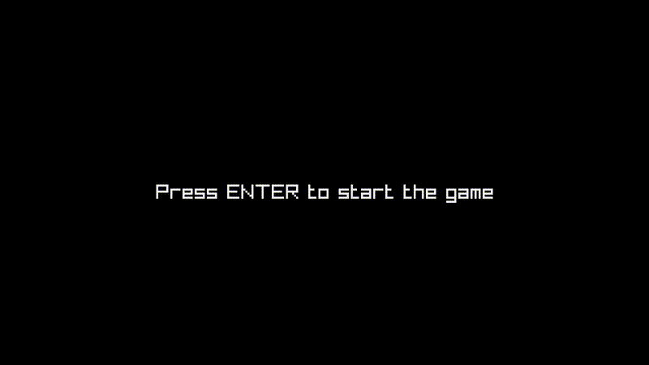

# Pong

A simple Pong game written in **C** using [raylib](https://www.raylib.com/).

## Features

* Classic two-player Pong gameplay
* Written in C
* Powered by raylib
* Cross-platform build using Make

## Demo



## Controls

| Player   | Up  | Down |
| -------- | --- | ---- |
| Player 1 | `W` | `S`  |
| Player 2 | `↑` | `↓`  |

## Pre-built Releases

Pre-built executables for Windows and Linux are available here: **[Releases](https://github.com/Claudiu-Meiu/Pong/releases)**

If you want to build the game yourself, follow the instructions below.

## Requirements

### Linux

You need:

* GCC
* GNU Make
* raylib

Make sure GCC, GNU Make, and raylib are installed and available on your system.

### Windows

The provided Makefile is intended to be used with **w64devkit**.

You need:

1. **w64devkit**
2. The **64-bit version of raylib**

Download the 64-bit raylib package and copy its contents into the **root directory of the Pong project**.

The `include/` and `lib/` directories from raylib are required by the Makefile.

These directories are **not included in this repository** and must be added manually.

After setting up raylib, the project should look approximately like this:

```text
Pong/
├── include/          # Added from the 64-bit raylib package
├── lib/              # Added from the 64-bit raylib package
├── demo/
│   └── pong_raylib_demo.png
├── resources/
├── src/
├── Makefile
└── ...
```

Make sure that `gcc` and `make` from w64devkit are available in your terminal.

## Building

Navigate to the root directory of the project:

```bash
cd Pong
```

Then run:

```bash
make
```

The Makefile will:

1. Find all `.c` files inside `src/`
2. Compile the game
3. Create the required output directories
4. Copy the contents of `resources/` to the output directory

The resulting executable will be located at:

```text
bin/Pong/pong
```

### Linux

Run the game with:

```bash
./bin/Pong/pong
```

### Windows

Run the game with:

```powershell
bin\Pong\pong.exe
```

## Cleaning

To remove the compiled game and copied resources:

```bash
make clean
```

This removes the entire `bin/` directory.

## Project Structure

The repository contains the following main directories:

```text
Pong/
├── demo/
│   └── pong_raylib_demo.png
├── resources/
├── src/
├── Makefile
└── ...
```

The `bin/` directory is generated automatically when running `make`.

After building, the generated structure will look approximately like:

```text
Pong/
├── bin/
│   └── Pong/
│       ├── pong
│       └── resources/
├── demo/
│   └── pong_raylib_demo.png
├── resources/
├── src/
├── Makefile
└── ...
```

## License

This project is licensed under the MIT License. See the [LICENSE](LICENSE) file for details.
